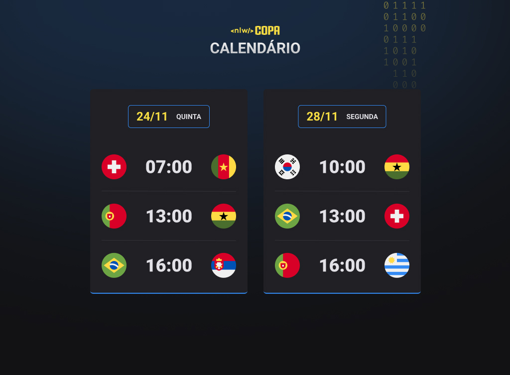

## Tecnologias

Esse projeto foi desenvolvido com as seguintes tecnologias:

- HTML e CSS
- JavaScript
- Git e GitHub

## Projeto

O calendário da copa é um projeto que mostra os jogos da Copa do Mundo 2022.
